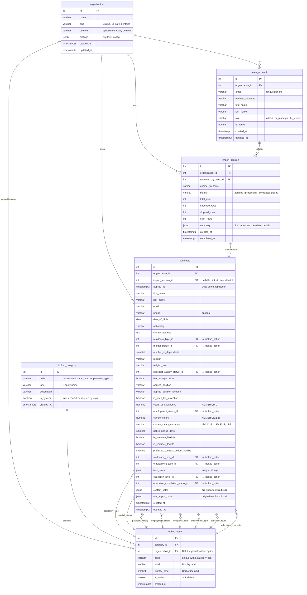
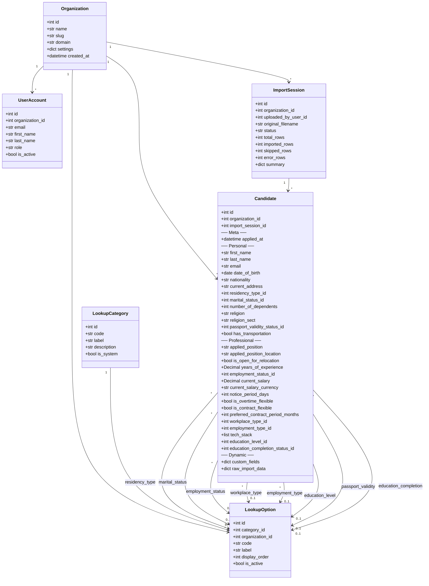

# HR Platform — Database Design Document

> **Version:** 2.0  
> **Date:** 2026-03-16  
> **Database:** PostgreSQL (relational, production-grade)  
> **Goal:** A multi-tenant HR platform with a fixed, well-structured schema. Excel imports follow the exact DB field structure — no column mapping needed.

---

## Table of Contents

1. [Design Philosophy & Why](#1-design-philosophy--why)
2. [Naming Convention Standards](#2-naming-convention-standards)
3. [Field Renaming Map (Your Fields → Production Fields)](#3-field-renaming-map)
4. [Complete ER / Class Diagram (Mermaid)](#4-complete-er--class-diagram)
5. [Table-by-Table Breakdown](#5-table-by-table-breakdown)
6. [Lookup Tables — The Dynamic Enum Pattern](#6-lookup-tables--the-dynamic-enum-pattern)
7. [Why Not Hard-Code Enums?](#7-why-not-hard-code-enums)
8. [Excel Import Flow — Full Pipeline](#8-excel-import-flow--full-pipeline)
9. [The `custom_fields` JSONB Column — True Dynamic Fields](#9-the-custom_fields-jsonb-column--true-dynamic-fields)
10. [Indexing Strategy](#10-indexing-strategy)
11. [Migration Path from Current Schema](#11-migration-path-from-current-schema)

---

## 1. Design Philosophy & Why

### Core Principles

| Principle | Why |
|---|---|
| **Snake_case everywhere** | PostgreSQL folds unquoted identifiers to lowercase. `snake_case` is the universal PG convention — no quoting headaches, readable in queries. |
| **Lookup tables for every enumerable value** | Hard-coding `1 = hybrid, 2 = remote` in application code is brittle. A lookup table lets any company add/remove/relabel options **without a code deploy**. |
| **Fixed schema, direct Excel import** | Excel files follow the exact DB column names. No column mapping, no fuzzy matching — just parse and insert. Keeps the import pipeline simple and fast. |
| **Structured columns for queryable fields + JSONB for the rest** | Structured columns give you indexes, type safety, and fast `WHERE` clauses. JSONB gives you infinite extensibility for fields that only certain companies need. |
| **Multi-tenant via `organization_id`** | Every row is scoped to an organization. Company X sees only its data. No separate databases, no separate schemas — just a column + RLS (Row-Level Security). |
| **Singular table names** | `candidate` not `candidates`. This is a PostgreSQL best practice — the table represents the *type*, not the collection. (Note: your existing code uses plural — either convention works if consistent; we go singular here for the new design.) |
| **`_id` suffix for foreign keys** | `workplace_type_id` makes it immediately clear this is a FK, not a raw value. |
| **`is_` prefix for booleans** | `is_overtime_flexible`, `is_contract_flexible`, `has_transportation` — self-documenting. |
| **`_at` suffix for timestamps** | `applied_at`, `created_at`, `updated_at` — consistent and clear. |

---

## 2. Naming Convention Standards

```
Database Objects:
  Tables       → snake_case, singular    → candidate, lookup_option
  Columns      → snake_case              → first_name, date_of_birth
  Primary Keys → id (integer, serial)    → candidate.id
  Foreign Keys → {referenced_table}_id   → workplace_type_id
  Booleans     → is_{adjective}          → is_overtime_flexible
                  has_{noun}              → has_transportation
  Timestamps   → {event}_at             → applied_at, created_at
  Indexes      → ix_{table}_{column}     → ix_candidate_email
  Constraints  → uq_{table}_{columns}    → uq_candidate_org_email
                  fk_{table}_{ref}        → fk_candidate_workplace_type
                  ck_{table}_{rule}       → ck_candidate_salary_positive
```

---

## 3. Field Renaming Map

Below is every field you listed, mapped to its production-grade database column name, with the reasoning.

### MetaData

| Your Name | DB Column | Type | Why |
|---|---|---|---|
| `timeStamp` | `applied_at` | `TIMESTAMPTZ` | "timestamp" is a reserved word in SQL. `applied_at` is descriptive — it's the date the candidate applied. Always use `TIMESTAMPTZ` (with timezone) in production PostgreSQL. |

### Personal Information

| Your Name | DB Column | Type | Why |
|---|---|---|---|
| `emailAddress` | `email` | `VARCHAR(320)` | RFC 5321 max email length is 320 chars. Simpler name since context is obvious. |
| `name` | `first_name` | `VARCHAR(100)` | Split into `first_name` to separate from family name. Enables sorting/searching by either independently. |
| `familyName` | `last_name` | `VARCHAR(100)` | Industry standard is `first_name` / `last_name`. "family_name" works too but `last_name` is more universally understood in English-speaking HR systems. |
| `dateOfBirth` | `date_of_birth` | `DATE` | Direct snake_case conversion. `DATE` type (no time component needed). |
| `nationality` | `nationality` | `VARCHAR(100)` | Kept as free text. Nationalities vary wildly; a lookup table is optional but recommended if you want filtering consistency. |
| `currentAddress` | `current_address` | `TEXT` | Addresses can be long. `TEXT` has no length limit in PG (internally same performance as `VARCHAR`). |
| `residencyType` | `residency_type_id` | `INTEGER FK` | Points to `lookup_option`. Examples: citizen, permanent_resident, work_visa, tourist_visa. |
| `maritalStatus` | `marital_status_id` | `INTEGER FK` | Points to `lookup_option`. Examples: single, married, divorced, widowed. |
| `numberOfKids` | `number_of_dependents` | `SMALLINT` | "dependents" is more inclusive and professional than "kids" (covers elderly parents, etc.). `SMALLINT` saves space (max 32,767 — more than enough). |
| `religion` | `religion` | `VARCHAR(100)` | Free text. Too many variations globally to enumerate reliably. |
| `religionSect` | `religion_sect` | `VARCHAR(100)` | Free text. Sub-denominations vary by region. |
| `pasportValidityStatus` | `passport_validity_status_id` | `INTEGER FK` | Points to `lookup_option`. Examples: valid, expired, no_passport, renewal_in_progress. Typo fixed: "pasport" → "passport". |
| `transportationAvailability` | `has_transportation` | `BOOLEAN` | Binary question → boolean. Cleaner than storing a string. Default `NULL` (unknown). |

### Professional Information

| Your Name | DB Column | Type | Why |
|---|---|---|---|
| `appliedForPosition` | `applied_position` | `VARCHAR(255)` | Concise. The "for" is redundant in a column name since context is clear. |
| `appliedForPositionLocation` | `applied_position_location` | `VARCHAR(255)` | Direct mapping — the location of the job being applied for. |
| `openForReallocation` | `is_open_for_relocation` | `BOOLEAN` | Fixed: "reallocation" → "relocation" (correct HR term). Boolean with `is_` prefix. |
| `yearsOfExperience` | `years_of_experience` | `NUMERIC(4,1)` | `NUMERIC(4,1)` allows values like `12.5` years. More precise than `FLOAT` (no floating-point rounding issues). |
| `employmentStatus` | `employment_status_id` | `INTEGER FK` | Points to `lookup_option`. Examples: employed, unemployed, freelance, student. |
| `currentSalary` | `current_salary` | `NUMERIC(12,2)` | `NUMERIC(12,2)` for exact decimal (up to 9,999,999,999.99). Never use `FLOAT` for money. |
| `noticePeriod` | `notice_period_days` | `SMALLINT` | Stored in **days** for calculable queries (e.g., "candidates available within 30 days"). If the Excel says "2 months", convert to 60 during import. |
| `overtimeFlexible` | `is_overtime_flexible` | `BOOLEAN` | Boolean with `is_` prefix. |
| `contractualPositionFlexibility` | `is_contract_flexible` | `BOOLEAN` | Shortened. Meaning: "Does the candidate accept contractual work?" |
| `contractPeriod` | `preferred_contract_period_months` | `SMALLINT` | Stored in **months** for consistency. NULL if not applicable. |
| `workPlaceType` | `workplace_type_id` | `INTEGER FK` | Points to `lookup_option`. Values: hybrid (1), remote (2), onsite (3). |
| `employmentType` | `employment_type_id` | `INTEGER FK` | Points to `lookup_option`. Values: full_time, part_time, contractual. |
| `techStack` | `tech_stack` | `JSONB` | Array of strings: `["Python", "React", "PostgreSQL"]`. JSONB allows indexing with GIN for fast `@>` containment queries. |
| `educationalLevel` | `education_level_id` | `INTEGER FK` | Points to `lookup_option`. Values: high_school, associate, bachelor, master, doctorate. |
| `educationalCompletion` | `education_completion_status_id` | `INTEGER FK` | Points to `lookup_option`. Values: completed, in_progress, incomplete, dropped_out. |

---

## 4. Complete ER / Class Diagram



### Simplified Class Diagram (OOP View)



---

## 5. Table-by-Table Breakdown

### `organization`
> **Purpose:** Multi-tenancy root. Every piece of data belongs to an organization.

| Column | Type | Notes |
|---|---|---|
| `id` | `SERIAL PK` | Auto-increment |
| `name` | `VARCHAR(255) NOT NULL` | "Acme Corp" |
| `slug` | `VARCHAR(100) UNIQUE NOT NULL` | URL-safe: "acme-corp" |
| `domain` | `VARCHAR(255)` | Optional: "acme.com" for SSO |
| `settings` | `JSONB DEFAULT '{}'` | Org-level toggles: `{"require_email": true}` |
| `created_at` | `TIMESTAMPTZ DEFAULT NOW()` | |
| `updated_at` | `TIMESTAMPTZ DEFAULT NOW()` | |

**Why?** Without this table, you cannot serve multiple companies. Adding it now (even if you start with one client) prevents a painful migration later. The `slug` is used in API URLs: `/api/orgs/acme-corp/candidates`.

---

### `user_account`
> **Purpose:** HR users who log in and manage candidates.

| Column | Type | Notes |
|---|---|---|
| `id` | `SERIAL PK` | |
| `organization_id` | `INT FK → organization.id NOT NULL` | |
| `email` | `VARCHAR(320) NOT NULL` | |
| `hashed_password` | `VARCHAR(255) NOT NULL` | bcrypt hash |
| `first_name` | `VARCHAR(100)` | |
| `last_name` | `VARCHAR(100)` | |
| `role` | `VARCHAR(50) DEFAULT 'hr_viewer'` | `admin`, `hr_manager`, `hr_viewer` |
| `is_active` | `BOOLEAN DEFAULT TRUE` | |
| `created_at` | `TIMESTAMPTZ DEFAULT NOW()` | |
| `updated_at` | `TIMESTAMPTZ DEFAULT NOW()` | |

**Unique constraint:** `(organization_id, email)` — same email can exist in different orgs.

---

### `lookup_category`
> **Purpose:** Defines the *types* of dropdowns in the system.

| Column | Type | Notes |
|---|---|---|
| `id` | `SERIAL PK` | |
| `code` | `VARCHAR(100) UNIQUE NOT NULL` | `workplace_type`, `employment_type`, etc. |
| `label` | `VARCHAR(255) NOT NULL` | "Workplace Type" |
| `description` | `TEXT` | "Where the employee will work" |
| `is_system` | `BOOLEAN DEFAULT TRUE` | System categories cannot be deleted by orgs |
| `created_at` | `TIMESTAMPTZ DEFAULT NOW()` | |

**Seed data (system categories):**

```
workplace_type          → "Workplace Type"
employment_type         → "Employment Type"
employment_status       → "Employment Status"
residency_type          → "Residency Type"
marital_status          → "Marital Status"
education_level         → "Education Level"
education_completion    → "Education Completion Status"
passport_validity       → "Passport Validity Status"
```

---

### `lookup_option`
> **Purpose:** The actual dropdown values within each category.

| Column | Type | Notes |
|---|---|---|
| `id` | `SERIAL PK` | This is the ID stored on `candidate` rows |
| `category_id` | `INT FK → lookup_category.id NOT NULL` | |
| `organization_id` | `INT FK → organization.id NULL` | `NULL` = global/system option visible to all orgs |
| `code` | `VARCHAR(100) NOT NULL` | Machine-readable: `hybrid`, `remote`, `onsite` |
| `label` | `VARCHAR(255) NOT NULL` | Human-readable: "Hybrid", "Remote", "On-Site" |
| `display_order` | `SMALLINT DEFAULT 0` | Controls UI sort order |
| `is_active` | `BOOLEAN DEFAULT TRUE` | Soft-delete: hide without breaking FK references |
| `created_at` | `TIMESTAMPTZ DEFAULT NOW()` | |

**Unique constraint:** `(category_id, organization_id, code)` — no duplicate codes within a category+org.

**Seed data example:**

```sql
-- Workplace Type
INSERT INTO lookup_option (category_id, code, label, display_order) VALUES
  ((SELECT id FROM lookup_category WHERE code = 'workplace_type'), 'hybrid',  'Hybrid',  1),
  ((SELECT id FROM lookup_category WHERE code = 'workplace_type'), 'remote',  'Remote',  2),
  ((SELECT id FROM lookup_category WHERE code = 'workplace_type'), 'onsite',  'On-Site', 3);

-- Employment Type
INSERT INTO lookup_option (category_id, code, label, display_order) VALUES
  ((SELECT id FROM lookup_category WHERE code = 'employment_type'), 'full_time',    'Full-Time',    1),
  ((SELECT id FROM lookup_category WHERE code = 'employment_type'), 'part_time',    'Part-Time',    2),
  ((SELECT id FROM lookup_category WHERE code = 'employment_type'), 'contractual',  'Contractual',  3);

-- Employment Status
INSERT INTO lookup_option (category_id, code, label, display_order) VALUES
  ((SELECT id FROM lookup_category WHERE code = 'employment_status'), 'employed',    'Employed',    1),
  ((SELECT id FROM lookup_category WHERE code = 'employment_status'), 'unemployed',  'Unemployed',  2),
  ((SELECT id FROM lookup_category WHERE code = 'employment_status'), 'freelance',   'Freelance',   3),
  ((SELECT id FROM lookup_category WHERE code = 'employment_status'), 'student',     'Student',     4);

-- Marital Status
INSERT INTO lookup_option (category_id, code, label, display_order) VALUES
  ((SELECT id FROM lookup_category WHERE code = 'marital_status'), 'single',   'Single',   1),
  ((SELECT id FROM lookup_category WHERE code = 'marital_status'), 'married',  'Married',  2),
  ((SELECT id FROM lookup_category WHERE code = 'marital_status'), 'divorced', 'Divorced', 3),
  ((SELECT id FROM lookup_category WHERE code = 'marital_status'), 'widowed',  'Widowed',  4);

-- Education Level
INSERT INTO lookup_option (category_id, code, label, display_order) VALUES
  ((SELECT id FROM lookup_category WHERE code = 'education_level'), 'high_school', 'High School',  1),
  ((SELECT id FROM lookup_category WHERE code = 'education_level'), 'associate',   'Associate',    2),
  ((SELECT id FROM lookup_category WHERE code = 'education_level'), 'bachelor',    'Bachelor',     3),
  ((SELECT id FROM lookup_category WHERE code = 'education_level'), 'master',      'Master',       4),
  ((SELECT id FROM lookup_category WHERE code = 'education_level'), 'doctorate',   'Doctorate',    5);

-- Education Completion
INSERT INTO lookup_option (category_id, code, label, display_order) VALUES
  ((SELECT id FROM lookup_category WHERE code = 'education_completion'), 'completed',    'Completed',    1),
  ((SELECT id FROM lookup_category WHERE code = 'education_completion'), 'in_progress',  'In Progress',  2),
  ((SELECT id FROM lookup_category WHERE code = 'education_completion'), 'incomplete',   'Incomplete',   3),
  ((SELECT id FROM lookup_category WHERE code = 'education_completion'), 'dropped_out',  'Dropped Out',  4);

-- Residency Type
INSERT INTO lookup_option (category_id, code, label, display_order) VALUES
  ((SELECT id FROM lookup_category WHERE code = 'residency_type'), 'citizen',             'Citizen',             1),
  ((SELECT id FROM lookup_category WHERE code = 'residency_type'), 'permanent_resident',  'Permanent Resident',  2),
  ((SELECT id FROM lookup_category WHERE code = 'residency_type'), 'work_visa',           'Work Visa',           3),
  ((SELECT id FROM lookup_category WHERE code = 'residency_type'), 'tourist_visa',        'Tourist Visa',        4),
  ((SELECT id FROM lookup_category WHERE code = 'residency_type'), 'student_visa',        'Student Visa',        5);

-- Passport Validity
INSERT INTO lookup_option (category_id, code, label, display_order) VALUES
  ((SELECT id FROM lookup_category WHERE code = 'passport_validity'), 'valid',                'Valid',                1),
  ((SELECT id FROM lookup_category WHERE code = 'passport_validity'), 'expired',              'Expired',              2),
  ((SELECT id FROM lookup_category WHERE code = 'passport_validity'), 'no_passport',          'No Passport',          3),
  ((SELECT id FROM lookup_category WHERE code = 'passport_validity'), 'renewal_in_progress',  'Renewal in Progress',  4);
```

---

### `candidate`
> **Purpose:** The core entity — one row per applicant per organization.

This is the main table. See the full column list in the ER diagram above. Key design decisions:

| Decision | Why |
|---|---|
| `organization_id NOT NULL` | Every candidate belongs to exactly one org. Enables RLS. |
| `import_session_id` nullable | Candidates can be entered manually (no import) or via Excel. |
| `current_salary` as `NUMERIC(12,2)` | Never use `FLOAT` for money — floating-point errors. `NUMERIC` is exact. |
| `current_salary_currency` | USD, EUR, LBP — you cannot compare salaries without knowing the currency. |
| `notice_period_days` as `SMALLINT` | Normalize to days for queryable comparisons. "2 months" → 60. |
| `tech_stack` as `JSONB` | `["Python", "React", "Docker"]` — PostgreSQL GIN index supports `@>` containment queries: "find all candidates who know React". |
| `custom_fields` as `JSONB` | Org-specific fields that aren't in the core schema. Company X can store `{"visa_sponsor_needed": true}` here. |
| `raw_import_data` as `JSONB` | The complete original row from Excel, untouched. Essential for debugging and auditing. |

**Unique constraint:** `(organization_id, email)` — same email cannot appear twice within one org. If email is `NULL`, duplicates are allowed (PG treats `NULL != NULL` in unique constraints).

---

### `import_session`
> **Purpose:** Tracks each Excel file upload as a discrete event.

Every time an HR user uploads a file, one `import_session` row is created. It tracks the overall status and summary.

| Column | Type | Notes |
|---|---|---|
| `id` | `SERIAL PK` | Auto-increment |
| `organization_id` | `INT FK → organization.id NOT NULL` | |
| `uploaded_by_user_id` | `INT FK → user_account.id NOT NULL` | Who uploaded this file |
| `original_filename` | `VARCHAR(255) NOT NULL` | "candidates_march_2026.xlsx" |
| `status` | `VARCHAR(50) DEFAULT 'pending'` | `pending`, `processing`, `completed`, `failed` |
| `total_rows` | `INT DEFAULT 0` | Total data rows detected |
| `imported_rows` | `INT DEFAULT 0` | Successfully inserted |
| `skipped_rows` | `INT DEFAULT 0` | Skipped (e.g. duplicate email) |
| `error_rows` | `INT DEFAULT 0` | Rows that failed validation |
| `summary` | `JSONB DEFAULT '{}'` | Final report with per-sheet details and row-level errors |
| `created_at` | `TIMESTAMPTZ DEFAULT NOW()` | |
| `completed_at` | `TIMESTAMPTZ` | Set when status → completed or failed |

**Status flow:**

```
pending → processing → completed
                     → failed (if critical errors)
```

**Why no separate sheet/mapping tables?** Excel files are expected to follow the exact database field structure. The system reads the headers, matches them 1:1 to `candidate` columns, and directly inserts rows. Per-sheet details (sheet names, row counts, errors) are stored in the `summary` JSONB column rather than in separate tables.

---

## 6. Lookup Tables — The Dynamic Enum Pattern

### The Pattern

Instead of 8 separate tables (`workplace_type`, `employment_type`, `marital_status`, ...), we use **2 tables** that handle all enumerations:

```
lookup_category (defines the "type" of dropdown)
    └── lookup_option (defines the actual choices)
```

### Why This Pattern?

| Benefit | Explanation |
|---|---|
| **Zero-migration additions** | Adding a new dropdown type (e.g., `visa_type`) = 1 INSERT into `lookup_category` + N INSERTs into `lookup_option`. No `ALTER TABLE`, no code deploy. |
| **Organization-specific options** | Org A might need `marital_status = "separated"`. They add it to `lookup_option` with their `organization_id`. Other orgs don't see it. |
| **Consistent API** | One endpoint: `GET /api/lookups/{category_code}` returns all options for any dropdown. Frontend doesn't need special handling per field. |
| **Audit-friendly** | Soft-delete via `is_active`. Old options remain in the DB (FK integrity preserved) but hidden from the UI. |

### How Lookups Work in the Candidate Table

```sql
-- Inserting a candidate with lookup values
INSERT INTO candidate (
    organization_id, first_name, last_name, email,
    workplace_type_id, employment_type_id
) VALUES (
    1, 'John', 'Doe', 'john@example.com',
    (SELECT id FROM lookup_option WHERE code = 'hybrid' AND category_id = (SELECT id FROM lookup_category WHERE code = 'workplace_type')),
    (SELECT id FROM lookup_option WHERE code = 'full_time' AND category_id = (SELECT id FROM lookup_category WHERE code = 'employment_type'))
);

-- Querying with human-readable labels (JOIN)
SELECT
    c.first_name,
    c.last_name,
    wt.label AS workplace_type,
    et.label AS employment_type
FROM candidate c
LEFT JOIN lookup_option wt ON c.workplace_type_id = wt.id
LEFT JOIN lookup_option et ON c.employment_type_id = et.id
WHERE c.organization_id = 1;
```

---

## 7. Why Not Hard-Code Enums?

You might think: "Why not just use PostgreSQL ENUMs or CHECK constraints?"

| Approach | Problem |
|---|---|
| `CHECK (workplace_type IN ('hybrid','remote','onsite'))` | Adding a 4th option requires `ALTER TABLE` → downtime risk in production. |
| PostgreSQL `CREATE TYPE workplace_type AS ENUM (...)` | Adding values requires `ALTER TYPE ... ADD VALUE` — cannot be done inside a transaction. Removing values is impossible without recreating the type. |
| Application-level constants | Different orgs need different options. Constants are global. |
| **Lookup tables ✓** | INSERTs only. No schema changes. Per-org customization. Works in transactions. |

---

## 8. Excel Import Flow — Full Pipeline

> **Assumption:** Excel files follow the exact database field structure. Column headers match `candidate` column names (e.g. `first_name`, `email`, `workplace_type_id`). No column mapping or fuzzy matching is needed.

```
┌──────────────────────────────────────────────────────────────────────┐
│                        EXCEL IMPORT PIPELINE                         │
├──────────────────────────────────────────────────────────────────────┤
│                                                                      │
│  STEP 1: UPLOAD & PARSE                                              │
│  ──────────────────────                                              │
│  • HR user uploads .xlsx file                                        │
│  • System creates import_session (status = "pending")                │
│  • File is parsed: sheets detected                                   │
│  • Headers are read from each sheet and validated against            │
│    the known candidate column names                                  │
│                                                                      │
│  STEP 2: ROW VALIDATION & IMPORT                                     │
│  ───────────────────────────────                                     │
│  • Session status → "processing"                                     │
│  • For each sheet, for each data row:                                │
│      - Type checking (is salary a valid number? is DOB a date?)      │
│      - Required fields (is email present?)                           │
│      - Lookup resolution: text values in lookup columns              │
│        (e.g. "remote") are resolved to lookup_option.id              │
│        via exact code/label match                                    │
│      - Duplicate detection: email within same org                    │
│      - If valid → INSERT into candidate                              │
│      - Original row stored in raw_import_data                        │
│      - If invalid → increment error_rows, log in summary JSONB      │
│                                                                      │
│  STEP 3: COMPLETION                                                  │
│  ──────────────────                                                  │
│  • Session status → "completed" (or "failed" if critical errors)     │
│  • Summary populated: total/imported/skipped/error counts            │
│  • Per-sheet breakdown stored in summary JSONB:                      │
│      {                                                               │
│        "sheets": [                                                   │
│          {                                                           │
│            "name": "Sheet1",                                         │
│            "total_rows": 150,                                        │
│            "imported": 145,                                          │
│            "skipped": 3,                                             │
│            "errors": [                                               │
│              {"row": 12, "error": "invalid email format"},           │
│              {"row": 87, "error": "unknown lookup code 'xyz'"}       │
│            ]                                                         │
│          }                                                           │
│        ]                                                             │
│      }                                                               │
│  • HR user can view imported candidates, apply filters, etc.         │
│                                                                      │
└──────────────────────────────────────────────────────────────────────┘
```

---

## 9. The `custom_fields` JSONB Column — True Dynamic Fields

### How It Works

Every `candidate` row has a `custom_fields JSONB` column. This is where organization-specific fields live.

```json
{
  "visa_sponsor_needed": true,
  "preferred_start_date": "2026-04-01",
  "referral_source": "LinkedIn",
  "internal_rating": 4.5,
  "language_proficiency": {
    "english": "fluent",
    "arabic": "native",
    "french": "intermediate"
  }
}
```

### Querying Custom Fields

PostgreSQL JSONB supports indexed queries:

```sql
-- Find candidates who need visa sponsorship
SELECT * FROM candidate
WHERE custom_fields->>'visa_sponsor_needed' = 'true'
  AND organization_id = 1;

-- GIN index for fast JSONB queries
CREATE INDEX ix_candidate_custom_fields ON candidate USING GIN (custom_fields);
```

---

## 10. Indexing Strategy

```sql
-- ═══════════════════════════════════════════════
-- Primary access patterns → B-tree indexes
-- ═══════════════════════════════════════════════

-- Multi-tenant filtering (almost every query includes this)
CREATE INDEX ix_candidate_org ON candidate (organization_id);

-- Common filters
CREATE INDEX ix_candidate_org_email ON candidate (organization_id, email);
CREATE INDEX ix_candidate_org_position ON candidate (organization_id, applied_position);
CREATE INDEX ix_candidate_org_nationality ON candidate (organization_id, nationality);
CREATE INDEX ix_candidate_org_yoe ON candidate (organization_id, years_of_experience);
CREATE INDEX ix_candidate_org_salary ON candidate (organization_id, current_salary);
CREATE INDEX ix_candidate_org_applied ON candidate (organization_id, applied_at DESC);
CREATE INDEX ix_candidate_org_created ON candidate (organization_id, created_at DESC);

-- Lookup FK indexes (for JOINs)
CREATE INDEX ix_candidate_workplace_type ON candidate (workplace_type_id);
CREATE INDEX ix_candidate_employment_type ON candidate (employment_type_id);
CREATE INDEX ix_candidate_employment_status ON candidate (employment_status_id);
CREATE INDEX ix_candidate_education_level ON candidate (education_level_id);

-- ═══════════════════════════════════════════════
-- Full-text search on name
-- ═══════════════════════════════════════════════
CREATE INDEX ix_candidate_name_search ON candidate 
  USING GIN (to_tsvector('simple', coalesce(first_name,'') || ' ' || coalesce(last_name,'')));

-- ═══════════════════════════════════════════════
-- JSONB indexes
-- ═══════════════════════════════════════════════
CREATE INDEX ix_candidate_tech_stack ON candidate USING GIN (tech_stack);
CREATE INDEX ix_candidate_custom_fields ON candidate USING GIN (custom_fields);

-- ═══════════════════════════════════════════════
-- Lookup table indexes
-- ═══════════════════════════════════════════════
CREATE INDEX ix_lookup_option_category ON lookup_option (category_id);
CREATE INDEX ix_lookup_option_org ON lookup_option (organization_id);
CREATE UNIQUE INDEX uq_lookup_option_cat_org_code ON lookup_option (category_id, COALESCE(organization_id, 0), code);

-- ═══════════════════════════════════════════════
-- Import tracking indexes
-- ═══════════════════════════════════════════════
CREATE INDEX ix_import_session_org ON import_session (organization_id);
CREATE INDEX ix_import_session_status ON import_session (status);
```

---

## 11. Migration Path from Current Schema

Your current `candidate` table has these columns:

```
id, data_source_id, row_index, full_name, email, nationality,
date_of_birth, position, expected_salary, expected_salary_text,
years_experience, notice_period, current_address, raw_data,
created_at, updated_at
```

### Migration Plan

| Current Column | New Column | Action |
|---|---|---|
| `id` | `id` | Keep |
| `data_source_id` | `import_session_id` | Rename + update FK reference |
| `row_index` | (move to `raw_import_data`) | Store in JSONB metadata |
| `full_name` | `first_name` + `last_name` | Split (write a migration script to split on last space) |
| `email` | `email` | Keep, change type to `VARCHAR(320)` |
| `nationality` | `nationality` | Keep |
| `date_of_birth` | `date_of_birth` | Keep |
| `position` | `applied_position` | Rename |
| `expected_salary` | `current_salary` | Rename + change to `NUMERIC(12,2)` |
| `expected_salary_text` | (move to `raw_import_data`) | Store in JSONB |
| `years_experience` | `years_of_experience` | Rename + change to `NUMERIC(4,1)` |
| `notice_period` | `notice_period_days` | Convert text → integer (migration script) |
| `current_address` | `current_address` | Keep, change type to `TEXT` |
| `raw_data` | `raw_import_data` | Rename |
| `created_at` | `created_at` | Keep |
| `updated_at` | `updated_at` | Keep |
| (new) | `organization_id` | Add, backfill with default org |
| (new) | `applied_at` | Add |
| (new) | All lookup FK columns | Add as nullable |
| (new) | All new boolean columns | Add as nullable |
| (new) | `custom_fields` | Add, default `'{}'::jsonb` |
| (new) | `tech_stack` | Add, default `'[]'::jsonb` |
| (new) | `current_salary_currency` | Add, default `'USD'` |

### Migration SQL Sketch

```sql
-- 1. Create new tables first
CREATE TABLE organization (...);
CREATE TABLE lookup_category (...);
CREATE TABLE lookup_option (...);
CREATE TABLE import_session (...);

-- 2. Insert default organization
INSERT INTO organization (name, slug) VALUES ('Default Organization', 'default');

-- 3. Alter candidate table
ALTER TABLE candidate ADD COLUMN organization_id INT REFERENCES organization(id);
ALTER TABLE candidate ADD COLUMN first_name VARCHAR(100);
ALTER TABLE candidate ADD COLUMN last_name VARCHAR(100);
-- ... add all new columns ...

-- 4. Backfill data
UPDATE candidate SET organization_id = (SELECT id FROM organization WHERE slug = 'default');
UPDATE candidate SET
  first_name = TRIM(SUBSTRING(full_name FROM '^[^ ]+')),
  last_name = TRIM(SUBSTRING(full_name FROM ' (.+)$'));

-- 5. Set NOT NULL after backfill
ALTER TABLE candidate ALTER COLUMN organization_id SET NOT NULL;

-- 6. Drop old columns
ALTER TABLE candidate DROP COLUMN full_name;
ALTER TABLE candidate RENAME COLUMN position TO applied_position;
-- etc.
```

---

## Summary

### Tables (6 total)

| Table | Purpose |
|---|---|
| `organization` | Multi-tenancy root |
| `user_account` | HR users who log in |
| `lookup_category` | Defines types of dropdowns |
| `lookup_option` | Actual dropdown values |
| `candidate` | Core entity — one row per applicant |
| `import_session` | Tracks each Excel file upload |

### What Makes This Design Flexible

| Feature | How |
|---|---|
| **New dropdown options** | INSERT into `lookup_option` — no migration |
| **New dropdown categories** | INSERT into `lookup_category` — no migration |
| **Org-specific extra fields** | Store values in `custom_fields` JSONB — no migration |
| **Different lookup options per company** | `lookup_option.organization_id` — org-specific options |
| **Simple Excel import** | Files match DB structure exactly — direct parse and insert, no mapping pipeline |
| **Schema evolution** | Core columns (indexed, queryable) + JSONB (flexible) = best of both worlds |

> **The golden rule:** If a field needs to be **filtered, sorted, or indexed** → it's a structured column.  
> If it's **nice-to-have, org-specific, or rarely queried** → it goes in `custom_fields` JSONB.
